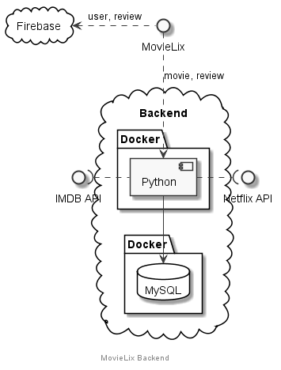
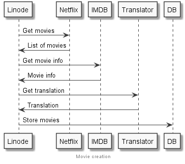
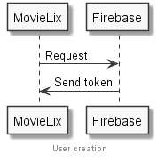
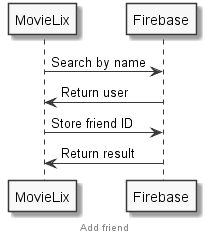
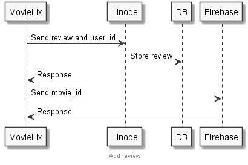
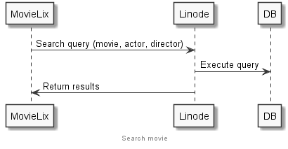
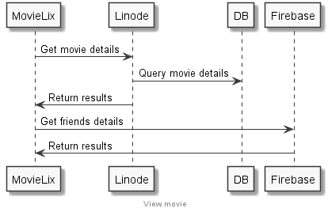

# MovieLix

## Índice

- [Películas](#Películas)
- [Usuarios](#Usuarios)
- [Firebase y Linode](#Firebase&#32;y&#32;Linode)

## Películas

### Información a guardar

- Netflix ID.
- IMDB ID.
- Título.
- Imagen pequeña y grande, o una mediana.
- Género.
- Tipo
- Sinopsis.
- Actores.
- Fecha de lanzamiento.
- Puntuación en Netflix.
- Retirada.
- Lista valoraciones.
- Rated (Opcional)
- Otras puntuaciones (Opcional)

### Obtención de películas

#### RapidAPI (Netflix)

Para obtener un listado de películas de __Netflix__ se puede usar [RapidAPI](https://rapidapi.com/unogs/api/unogs/endpoints). Este API provee distintos _endpoints_, los más útiles parecen los siguientes:

- `GET New release per country`: lista de nuevas peliculas por país (en inglés).

- `GET Deleted`: lista de películas descatalogadas.

El _endpoint_ para obtener las películas contiene varios problemas:

1. Sólo hay una imagen muy pequeña, puede servir para el _thumbnail_ pero no para mostrar los detalles de la película.
2. Falta mucha información sobre la película:
    - Género.
    - Rated.
    - Actores/director

Del mismo API de Netflix se puede sacar algo de información:

- `GET Load title details`:
  - Género
  - Actores/director
  - Imagen más grande.

#### RapidAPI (IMDB)

Una mejor opción es sacar el id de __IMDB__ y acceder a su API (también disponible con RapidAPI), en el que con el siguiente _endpoint_ se puede sacar toda la información y bien formateado:

`GET by ID or Title`

Con este _endpoint_ se puede sacar el toda la información:

- Rated.
- Imagen a un tamaño decente.
- Actores, directores.
- Otras puntuaciones.

#### TheMovieDB API

Sin embargo, necesitamos sacar la información en español, para eso utilizamos el API de [TheMovieDB](https://developers.themoviedb.org/3/movies/get-movie-details), en concreto, el siguiente _endpoint_:

- `GET /movie/{movie_id}`.

De aquí lo único que nos interesa es todo lo que venga traducido al español:

- Título
- Sinopsis
- Género
- Lema

Tabla mostrando el uso de cada API:

| Campo                 | API              | Endpoint |
|-----------------------|------------------|----------|
| Netflix ID            | RapidAPI Netflix |          |
| IMDB ID               | RapidAPI Netflix |          |
| Título                | TheMovieDB       |          |
| Imagen                | RapidAPI IMDB    |          |
| Género                | TheMovieDB       |          |
| Tipo                  | TheMovieDB       |          |
| Sinopsis              | TheMovieDB       |          |
| Actores               | RapidAPI IMDB    |          |
| Fecha de lanzamiento  | RapidAPI IMDB    |          |
| Puntuación en Netflix | RapidAPI Netflix |          |
| Retirada              | RapidAPI Netflix |          |
| Rated                 | RapidAPI IMDB    |          |
| Otras puntuaciones    | RapidAPI IMDB    |          |

### Almacenamiento

Con esto en mente, parece que es necesario un servidor con el que obtener toda esta información y procesarla de una forma más eficiente.

El servidor debería cada día sacar el listado de nuevas películas y toda la información asociada a cada una de ellas, además de:

- Descargar las imágenes.

## Usuarios

### Información a guardar

- Nombre.
- Email.
- Lista de amigos.
- Lista de películas valoradas.

### Creación de usuarios

[Firebase](https://firebase.google.com/) parece la opción más adecuada ya que encapsula todo el proceso de autenticación y almacenamiento. Además, se puede guardar información extra en el usuario, como la lista de amigos y valoraciones.

## Firebase y Linode

### Arquitectura

    

### Integración

Hay que definir cómo manejar ambos servicios en las siguientes operaciones teniendo que ni __Firebase__ ni _Linode_ se pueden comunicar entre sí:

- [Creacion de película](#Creación&#32;de&#32;película)
- [Creación de usuario](#Creación&#32;de&#32;usuario)
- [Añadir amigo](#Nueva&#32;valoración)
- [Nueva valoración](#Nueva&#32;valoración)
- [Buscar película](#Buscar&#32;película)
- [Visualizar película](#Visualizar&#32;película)

### Creación de película

Cada día nuestro servidor debe usar el API de Netflix para obtener el listado de nuevas películas y, por cada una, obtener toda la información necesaria.

Una vez con toda la información de cada película, se deben descargar las imágenes y guardarlas en el directorio de Apache para que sean accesibles.

Una vez descargadas, las películas se deben guardar en base de datos.

Diagrama:

    

### Creación de usuario

El usuario se debe registrar usando __Facebook__, __Google__ o con un __email__. Firebase se encarga de crearlo y devolver un token a modo de identificador para loguearse las siguientes veces.

En principio a _Linode_ no le debería interesar saber que un usuario nuevo se ha registrado.

Diagrama:

    

### Añadir amigo

Para añadir un amigo, primero es necesario buscarlo usando el nombre de usuario. Una vez encontrado, sólo es necesario enviar el id de usuario del amigo para que Firebase lo almacene en el usuario.

Diagrama:

    

### Nueva valoración

Para añadir una valoración, la app debe enviar primero a nuestro servidor el id de usuario de Firebase y, si ha ido todo bien, enviar el id de la película a Firebase para que lo almacene en el usuario.

Diagrama:

    

### Buscar película

Para buscar una película, primero se busca por el nombre, actor o director en el servidor, si éste devuelve resultados, por cada película devuelta se debe pedir la información de cada usuario a Firebase.

Otra opción es guardar una información básica del usuario junto a la película para evitar llamar a Firebase.

Diagrama:

    

### Visualizar película

Al pinchar en una valoración o al buscar una película, debería abrirse una pantalla con toda la información de la película, así como sus valoraciones. Para ello, la app tiene que llamar primero a _Linode_ para saber qué usuarios han valorado la película para, a continuación, pedir a Firebase los datos de esos usuarios.

Diagrama:

    

