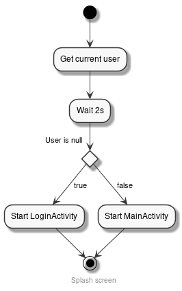

# App

- [App](#app)
  - [Splash screen](#splash-screen)
  - [Authentication](#authentication)
    - [Google](#google)
    - [Facebook](#facebook)
    - [Twitter](#twitter)
  - [Firestore](#firestore)

## Splash screen

The splash screen is used to get the current user through `Firebase` and route to the appropiate screen:

    

## Authentication

The authentication can be done with 4 different providers, all of them handled by __Firebase__:

- Email/Password.
- Google.
- Facebook.
- Twitter.

### Google

- [Authenticate Using Google Sign-In on Android](https://firebase.google.com/docs/auth/android/google-signin)
  - [Integrating Google Sign-In into Your Android App](https://developers.google.com/identity/sign-in/android/sign-in?hl=en)

### Facebook

- [Authenticate Using Facebook Login on Android](https://firebase.google.com/docs/auth/android/facebook-login)
- [Facebook for Developers](https://developers.facebook.com/apps/592176878302149/dashboard/)

### Twitter

- [Authenticate Using Twitter on Android](https://firebase.google.com/docs/auth/android/twitter-login)

## Firestore

We use [Firestore](https://firebase.google.com/docs/firestore) to store all the user's information, such as, name, email, reviews, etc.

Everytime a new user registers into the system, a new user has to created in the `users` database. If it's already registered, the app will retrieve the user's information.
