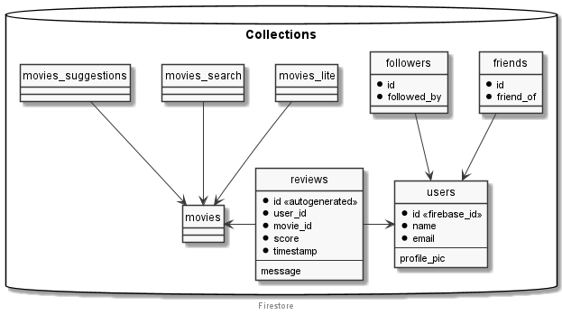

# Collections

## users

We need to store extra information about the users. That information cannot be stored __Firebase__, so we need to use __Firestore__:

| Fields      |  Type  | Nullable | Notes                 |
| ----------- | :----: | :------: | :-------------------- |
| id          | String |    ❌     | Taken from `Firebase` |
| name        | String |    ❌     | Taken from `Firebase` |
| photo_url   | String |    ✔️     | Taken from `Firebase` |
| num_reviews | Number |    -     |                       |

## movies

Collection to store all the movies retrieved by __Linode__. Field names are just numbers to reduce data usage.

| Fields |  Type  | Nullable | Notes   |
| ------ | :----: | :------: | :------ |
| 2      | String |    ❌     | Title   |
| 3      | Number |   TBD    | Year    |
| 4      | String |    ✔️     | Summary |
| 5      | Number |   TBD    |         |
| 6      | Number |   TBD    |         |
| 7      | Number |   TBD    |         |
| 8      | Number |   TBD    |         |
| 9      | Number |   TBD    |         |
| 10     | Number |   TBD    |         |

## reviews

Collection to store the users' reviews.

| Fields    |  Type  | Nullable | Notes                 |
| --------- | :----: | :------: | :-------------------- |
| movie     | String |    ❌     | Taken from `Firebase` |
| score     | String |    ❌     | Taken from `Firebase` |
| user      | String |    ❌     | Taken from `Firebase` |
| timestamp | String |    ❌     | Taken from `Firebase` |
| comment   | String |    ✔️     | Taken from `Firebase` |

## friends

Collection to store the users' friends.

| Fields    |      Type       | Nullable | Notes                 |
| --------- | :-------------: | :------: | :-------------------- |
| id        |     String      |    ❌     | Taken from `Firebase` |
| friend_of | Array of String |    ❌     | Taken from `Firebase` |

## followers

Collection to store the users' followers.

| Fields      |      Type       | Nullable | Notes                 |
| ----------- | :-------------: | :------: | :-------------------- |
| id          |     String      |    ❌     | Taken from `Firebase` |
| followed_by | Array of String |    ❌     | Taken from `Firebase` |

---

    

