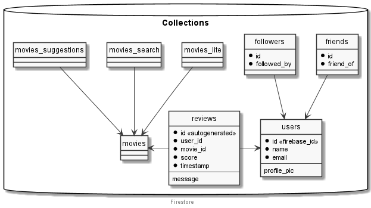

# MovieLix

- [MovieLix](#movielix)
  - [Architecture](#architecture)
    - [Firestore](#firestore)
  - [Usuarios](#usuarios)
  - [GitFlow](#gitflow)

## Architecture

This project contains three main components:

- The backend ([Linode](./linode.md)): our server implemented in `Python`.
- The [app](./app.md): our application implemented in `Android`.
- `Firestore`: Google's realtime database for storing all the information.

This diagram shows our architecture:

    

### Firestore

We store all the stuff in `Firestore`, which will contain the following collections:

    

## Usuarios

The authentication project is handled by [Firebase](https://firebase.google.com/).

## GitFlow

In this project we follow the `GitFlow` workflow:

