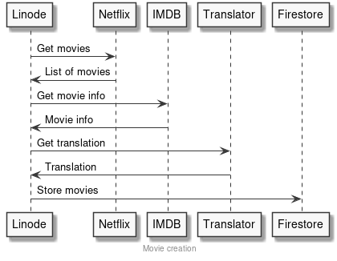

# Linode

- [Linode](#linode)
  - [Películas](#pel%c3%adculas)
    - [Información a guardar](#informaci%c3%b3n-a-guardar)
    - [Obtención de películas](#obtenci%c3%b3n-de-pel%c3%adculas)
      - [RapidAPI (Netflix)](#rapidapi-netflix)
      - [RapidAPI (IMDB)](#rapidapi-imdb)
      - [TheMovieDB API](#themoviedb-api)
    - [Almacenamiento](#almacenamiento)
    - [Creación de película](#creaci%c3%b3n-de-pel%c3%adcula)

## Películas

### Información a guardar

- Netflix ID.
- IMDB ID.
- Título.
- Imagen pequeña y grande, o una mediana.
- Género.
- Tipo
- Sinopsis.
- Actores.
- Fecha de lanzamiento.
- Puntuación en Netflix.
- Retirada.
- Lista valoraciones.
- Rated (Opcional)
- Otras puntuaciones (Opcional)

### Obtención de películas

#### RapidAPI (Netflix)

Para obtener un listado de películas de __Netflix__ se puede usar [RapidAPI](https://rapidapi.com/unogs/api/unogs/endpoints). Este API provee distintos _endpoints_, los más útiles parecen los siguientes:

- `GET New release per country`: lista de nuevas peliculas por país (en inglés).

- `GET Deleted`: lista de películas descatalogadas.

El _endpoint_ para obtener las películas contiene varios problemas:

1. Sólo hay una imagen muy pequeña, puede servir para el _thumbnail_ pero no para mostrar los detalles de la película.
2. Falta mucha información sobre la película:
    - Género.
    - Rated.
    - Actores/director

Del mismo API de Netflix se puede sacar algo de información:

- `GET Load title details`:
  - Género
  - Actores/director
  - Imagen más grande.

#### RapidAPI (IMDB)

Una mejor opción es sacar el id de __IMDB__ y acceder a su API (también disponible con RapidAPI), en el que con el siguiente _endpoint_ se puede sacar toda la información y bien formateado:

`GET by ID or Title`

Con este _endpoint_ se puede sacar el toda la información:

- Rated.
- Imagen a un tamaño decente.
- Actores, directores.
- Otras puntuaciones.

#### TheMovieDB API

Sin embargo, necesitamos sacar la información en español, para eso utilizamos el API de [TheMovieDB](https://developers.themoviedb.org/3/movies/get-movie-details), en concreto, el siguiente _endpoint_:

- `GET /movie/{movie_id}`.

De aquí lo único que nos interesa es todo lo que venga traducido al español:

- Título
- Sinopsis
- Género
- Lema

Tabla mostrando el uso de cada API:

| Campo                 | API              | Endpoint |
|-----------------------|------------------|----------|
| Netflix ID            | RapidAPI Netflix |          |
| IMDB ID               | RapidAPI Netflix |          |
| Título                | TheMovieDB       |          |
| Imagen                | RapidAPI IMDB    |          |
| Género                | TheMovieDB       |          |
| Tipo                  | TheMovieDB       |          |
| Sinopsis              | TheMovieDB       |          |
| Actores               | RapidAPI IMDB    |          |
| Fecha de lanzamiento  | RapidAPI IMDB    |          |
| Puntuación en Netflix | RapidAPI Netflix |          |
| Retirada              | RapidAPI Netflix |          |
| Rated                 | RapidAPI IMDB    |          |
| Otras puntuaciones    | RapidAPI IMDB    |          |

### Almacenamiento

Con esto en mente, parece que es necesario un servidor con el que obtener toda esta información y procesarla de una forma más eficiente.

El servidor debería cada día sacar el listado de nuevas películas y toda la información asociada a cada una de ellas en `Firestore`, además de:

- Descargar las imágenes.
  
### Creación de película

Cada día nuestro servidor debe usar el API de Netflix para obtener el listado de nuevas películas y, por cada una, obtener toda la información necesaria.

Una vez con toda la información de cada película, se deben descargar las imágenes y guardarlas en el directorio de Apache para que sean accesibles.

Una vez descargadas, las películas se deben guardar en `Firestore`.

Diagrama:

    

